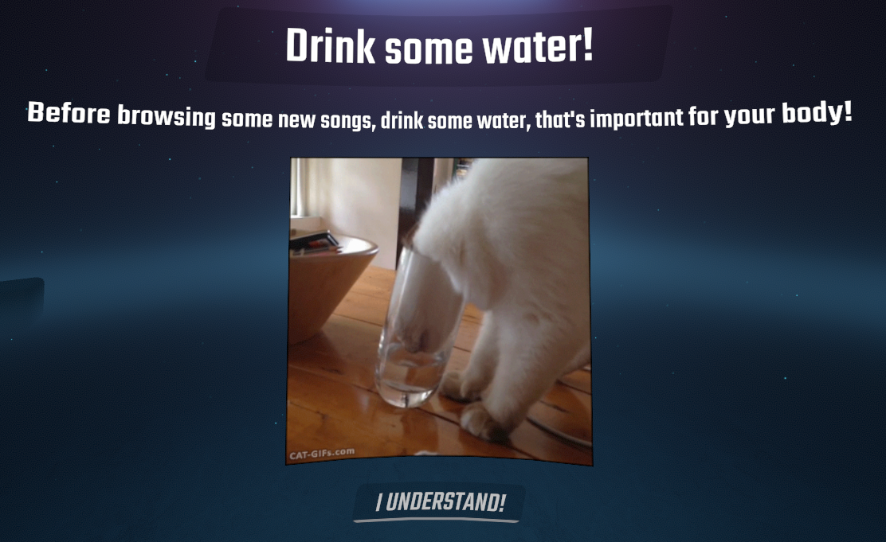

# BeatSaberDrinkWater 
Beat Saber mod to remind you of the importance of hydration
## Usage
DrinkWater's settings can be accessed from the Mod Settings panel.
### Image Sources
DrinkWater has three sources in which it gets it's images from.
* **Classic** - These are the images used by the original DrinkWater mod.
* **Nya** - These images are sourced from [Waifu.Pics](https://waifu.pics/) using the Nya endpoint.
* **Local** - These images are accessed from the UserData\DrinkWater file. Only PNG, JPEG, GIF and APNG files will be used.
## Installation
Download the latest version of DrinkWater from [releases](https://github.com/Sirspam/DrinkWater/releases) and slap it into your Beat Saber's plugin folder.

DrinkWater requires BSML and SiraUtil, which can both be found in ModAssistant.
## Contribution
Feel free to point out any suggestions or improvements by submitting a PR or contacting me on Discord ([Sirspam#7765](https://discordapp.com/users/232574143818760192)).

